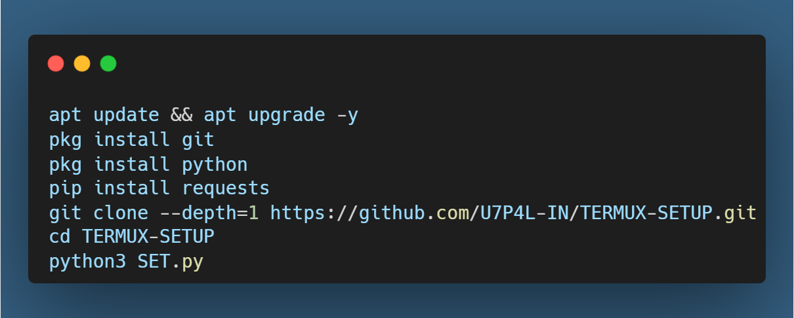
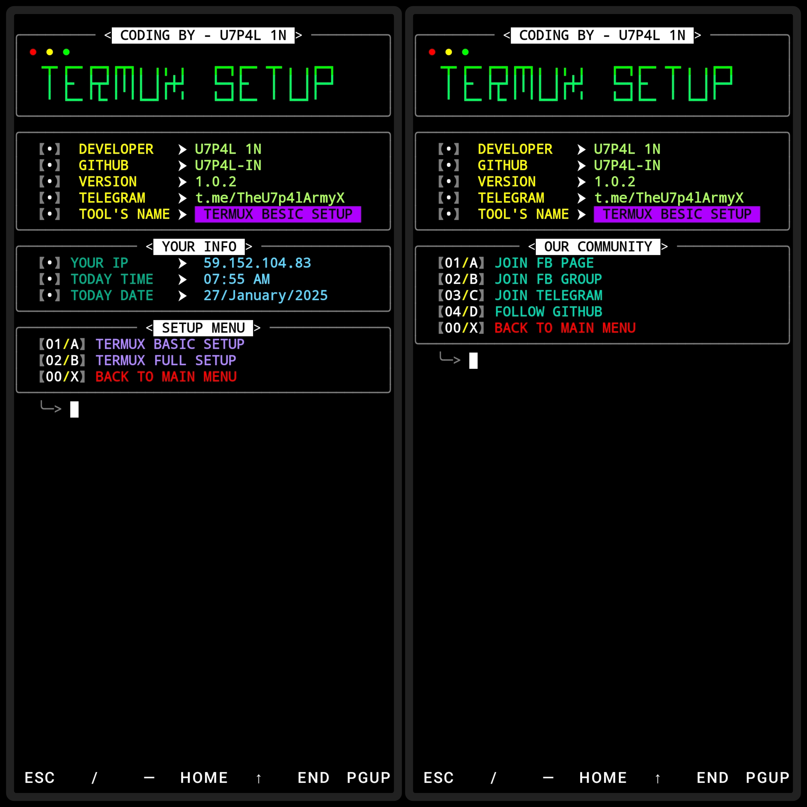
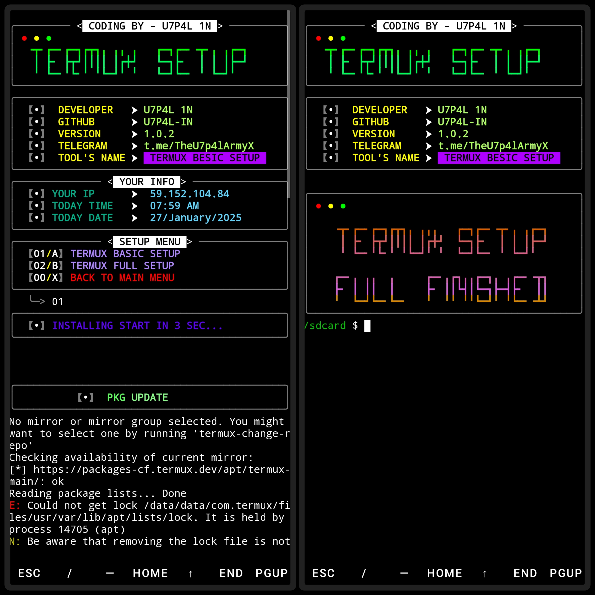

</p>
   <p align="center">
      <a href="https://github.com/U7P4L-IN/TERMUX-SETUP/stargazers">
      </a>
      <a href="https://github.com/U7P4L-IN/TERMUX-SETUP/releases/latest">
      </a>
      <a href="https://www.conventionalcommits.org/en/v1.0.0/">
      </a>
      <a href="https://github.com/U7P4L-IN/TERMUX-SETUP/actions/workflows/github-action.yml">
      </a>
   </p>
   
</br>
<p align="center">

> Welcome to the **Termux Setup Tools**, a professional and user-friendly Bash script designed to optimize your Termux environment! This script installs essential packages, configures your terminal, tests internet speed, displays system information, and much more!  


## Language</br>

 <p align="center">


</p>

## Tested On >

* TERMUX
## **📖 How It Works**  

1. **Check & Install Packages**:  
   - The script checks if each package is already installed.  
   - Installs only missing packages, skipping those already present.  

2. **Update & Upgrade**:  
   - Ensures your Termux environment is up-to-date.  

3. **Optimize Storage**:  
   - Removes unnecessary files and caches to reclaim space. 

## **🛡️ Requirements**  

- Termux environment.  
- Internet connection for downloading packages.  

## INSTALL  ON TERMUX
```python
apt update && apt upgrade -y
pkg install git
pkg install python
pip install requests
git clone --depth=1 https://github.com/U7P4L-IN/TERMUX-SETUP.git
cd TERMUX-SETUP
python3 SET.py
```

<p align="center">

## TERMUX >

<p align="center">
<p align="center">

### Tools Languages :

<p align="center">

</p>

<br>

### Contributing
Feel Free To Clone This Project. For Major Changes, Please Open An Issue First To Discuss What You Would Like To Change Or Add, Thank You!!.

<h2 align="center">LICENSE</h2>

**TERMUX-SETUP** is released under the GNU General Public License v3.0, which grants the following permissions:
- Commercial use
- Distribution
- Patent use

## **❓ FAQ**  

### 1️⃣ What happens if a package is already installed?  
The script skips reinstallation and informs you with a message like:  
`Package xyz is already installed.`

For more convoluted language, see the [LICENSE](/LICENSE).
</br>

<h5 align="center"><b>DESCRIPTION</b></h5>

* ©️ Copyright Message
>> Copyright © [2023-27] [U7P4L-IN]
>All rights reserved. This Python project, along with its code, documentation, and any associated files, is the intellectual property of ANONYMOUS CYBER. You may not reproduce, distribute, or modify the contents of this repository without explicit permission from the owner.
## Give A Star ⭐
> You can also give this repository a star to show more people and they can use this repository.